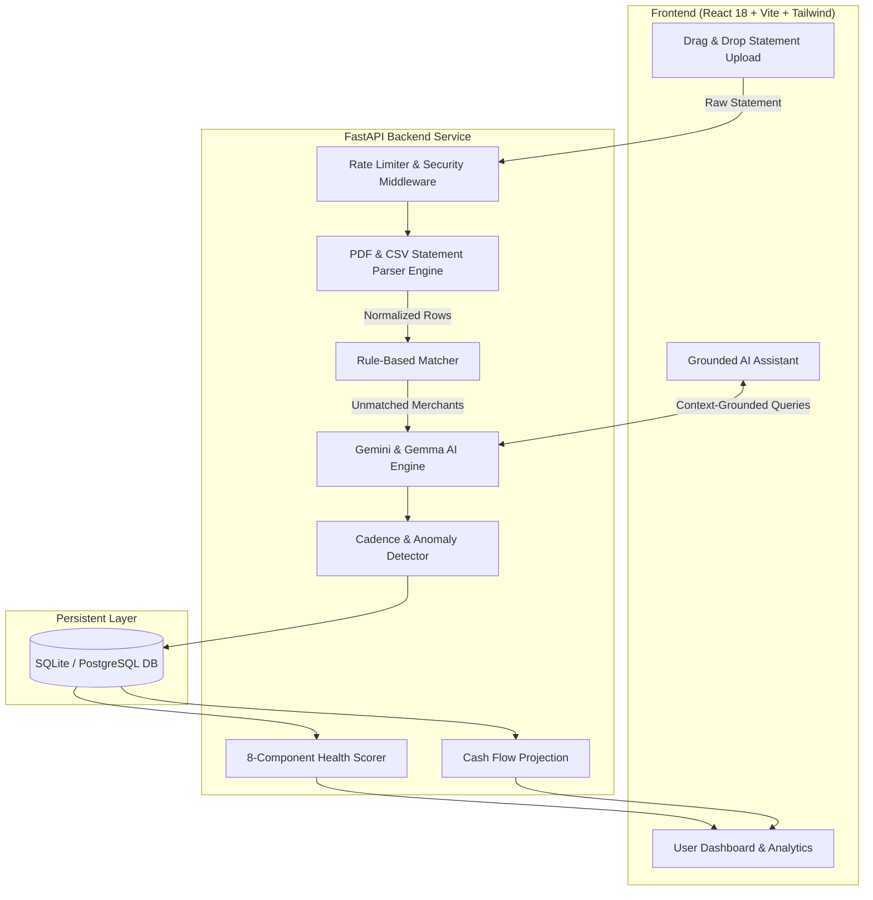

<div align="center">

  

  <p align="center">
    <strong>Turn raw bank statements into actionable intelligence, predictive cash-flow forecasts, and grounded AI insights.</strong>
  </p>

  <p align="center">
    <a href="https://fastapi.tiangolo.com/"></a>
    <a href="https://react.dev/"></a>
    <a href="https://www.typescriptlang.org/"></a>
    <a href="https://tailwindcss.com/"></a>
    <a href="https://deepmind.google/technologies/gemini/"></a>
    <a href="LICENSE"></a>
  </p>

  <p align="center">
    <a href="#-overview">Overview</a> •
    <a href="#-key-features">Features</a> •
    <a href="#-system-architecture">Architecture</a> •
    <a href="#-tech-stack">Tech Stack</a> •
    <a href="#-quick-start">Quick Start</a> •
    <a href="#-ai-model-routing">AI Routing</a> •
    <a href="#-sample-data">Sample Data</a>
  </p>

</div>

---

## 🌟 Overview

**PFIP (Personal Finance Intelligence Platform)** is an offline-capable, privacy-first personal finance system. Instead of asking for net-banking credentials or relying on third-party aggregators, PFIP lets you upload your raw PDF or CSV statement exports (HDFC, ICICI, SBI, Axis, etc.) and instantly turns months of transactions into:

- **Automated Categorization** with a 3-tier hierarchy: Custom User Rules ➔ Google Gemini AI ➔ Deterministic Offline Fallbacks.
- **Predictive Cash-Flow Forecasting** that projects recurring subscriptions, income cadences, and median burn onto a 30–90 day timeline.
- **8-Component Financial Health Score** evaluating savings rate, emergency reserve, discretionary ratio, debt-to-income, and stability.
- **Grounded AI Financial Assistant** citing real transaction data with streaming responses—never hallucinating figures.
- **Comprehensive Portability** with paginated PDF reports, CSV balance sheets, and single-click full JSON database archives.

---

## 🚀 Key Features

<table width="100%">
  <tr>
    <td width="50%" valign="top">
      <h4>📥 Multi-Bank Statement Ingestion</h4>
      <p>Intelligently handles fragmented CSV headers, debit/credit column splits, Dr/Cr markers, and reverse-chronological PDF e-statements without requiring manual formatting.</p>
    </td>
    <td width="50%" valign="top">
      <h4>🧠 Resilient AI & Rule Engine</h4>
      <p>User-defined merchant rules take top priority, followed by Gemini AI categorization (<code>gemini-3.6-flash</code> / <code>gemma-4-26b-a4b-it</code>), with graceful local keyword fallbacks when offline.</p>
    </td>
  </tr>
  <tr>
    <td width="50%" valign="top">
      <h4>🔮 Cash Flow & Runway Radar</h4>
      <p>Identifies recurring obligations, forecasts upcoming subscription dues, detects stealth price increases, and models future balance trajectories.</p>
    </td>
    <td width="50%" valign="top">
      <h4>📈 Dynamic Analytics & Budgets</h4>
      <p>Pacing-aware category caps that warn you mid-month before overshooting, accompanied by savings targets and goal finish-line estimates.</p>
    </td>
  </tr>
  <tr>
    <td width="50%" valign="top">
      <h4>💬 Grounded AI Financial Assistant</h4>
      <p>Conversational assistant powered by contextual retrieval (RAG-lite) over real transaction records with live streaming answers and verification chips.</p>
    </td>
    <td width="50%" valign="top">
      <h4>🔒 Privacy-Preserving by Design</h4>
      <p>Data stays entirely in your own database. Passwords hashed using PBKDF2-SHA256 (260,000 rounds). Zero credential-sharing with financial institutions.</p>
    </td>
  </tr>
</table>

---

## 🏗️ System Architecture



---

## 💻 Tech Stack

| Layer | Technologies |
|---|---|
| **Frontend** | React 18, TypeScript, Vite, Tailwind CSS, Framer Motion, TanStack Query, Recharts, Lucide Icons |
| **Backend** | FastAPI, Starlette, Pydantic v2, SQLAlchemy, Uvicorn, Gunicorn |
| **AI / ML** | Google GenAI SDK (`gemini-3.6-flash`, `gemma-4-26b-a4b-it`), NumPy, PyTorch (optional anomaly autoencoder) |
| **Parsing & Reports** | pdfplumber, pypdf, pandas, ReportLab (PDF export) |
| **Security** | PBKDF2-SHA256 (260k rounds), JWT Bearer Auth, In-Memory Sliding Window Rate Limiting |

---

## ⚡ Quick Start

### Prerequisites
- **Node.js**: v18+ (v20+ recommended)
- **Python**: 3.10+ (tested on Python 3.11, 3.12, 3.13)

---

### 1. Backend Setup

```bash
# Navigate to backend directory
cd backend

# Create and activate virtual environment
python -m venv .venv
# Windows:
.venv\Scripts\activate
# Linux/macOS:
source .venv/bin/activate

# Install dependencies
pip install -r requirements.txt

# Configure environment file
copy .env.example .env    # Linux/macOS: cp .env.example .env

# Run API server
uvicorn app.main:app --reload --port 8000
```

> **API Endpoint:** [http://localhost:8000](http://localhost:8000)  
> **Interactive Swagger Docs:** [http://localhost:8000/docs](http://localhost:8000/docs)

---

### 2. Frontend Setup

```bash
# In a new terminal, navigate to frontend directory
cd frontend

# Install dependencies
npm install

# Start Vite dev server
npm run dev
```

> **Web Application:** [http://localhost:5173](http://localhost:5173)  
> *(API calls are automatically proxied to `http://localhost:8000`)*

---

## 🤖 AI Model Routing

PFIP implements dual-tier model routing configured in `backend/.env`:

| Role | Configured Model | Environment Variable | Purpose |
|---|---|---|---|
| **Main / Reasoning** | `gemini-3.6-flash` | `GEMINI_MODEL_MAIN` | Conversational assistant, insight generation, and executive summaries |
| **Lite / High-Volume** | `gemma-4-26b-a4b-it` | `GEMINI_MODEL_LITE` | Rapid transaction categorization and merchant normalization |

```env
# backend/.env
GEMINI_API_KEY=your_gemini_api_key_here
GEMINI_MODEL_MAIN=gemini-3.6-flash
GEMINI_MODEL_LITE=gemma-4-26b-a4b-it
```

> **Offline Mode:** If `GEMINI_API_KEY` is not set, PFIP runs completely offline using deterministic local heuristics and keyword categorization dictionaries.

---

## 📁 Sample Data

Test statements are included in the [`sample-statements/`](sample-statements/) directory:
- `salaried-hdfc-18months.csv` — 18 months of typical salaried income, utility bills, subscriptions, and investments.
- `freelancer-icici-15months.csv` — Irregular client retainers, SaaS subscriptions, and variable expenses.
- `family-sbi-24months.csv` — Two years of multi-account family budgeting, groceries, and medical expenses.

---

## 📄 License

This project is licensed under the [MIT License](LICENSE).
# PFIP

